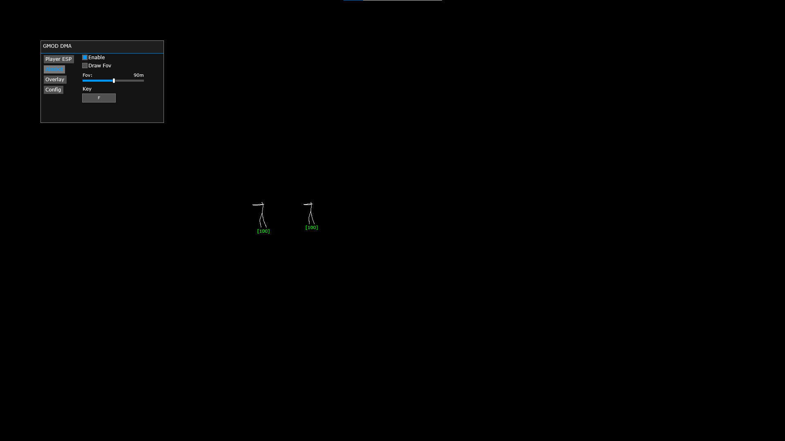

# GmodDMA
DMA ESP Aimbot / Esp for Garry's Mod (x64) based on IntelSDM Squad cheat

## Esp

  

## Desc
Based on [IntelSDM Squad Dma Cheat](https://github.com/IntelSDM/SquadDMA) and [Nexus External ESP](https://github.com/Calvineries/Gmod-Nexus-External-ESP).

## Features
Player ESP
   * Name
   * Text Color
   * Distance
   * Health
   * Max Distance
   * Text Size
   * Bone esp (without checkbox, hide when target is dormant)

Aimbot
   * Enable
   * Draw Fov
   * No Recoil
   * Fov
   * Key (default [F])

Overlay
   * Override W2S Resolution (custom resolution)

## Main changes and problems
* what i add
  * Rewrite w2s
  * Bone esp (work only on dormant players)
  * Add aimbot (target = closest to crosshair)
  * Add retry when localplayer is null
  * More beautiful esp

* what is bad
  * folders hierarchy
  * names dont work
  * bad bone loop
  * all gmod proccesess loop, because i have some problem with pid

[actual offsets you can find here](https://github.com/Calvineries/Gmod-Nexus-External-ESP)

## Credits
* [IntelSDM](https://github.com/IntelSDM)
* [Calvineries](https://github.com/Calvineries)
* [PCILeech](https://github.com/ufrisk/pcileech)
* [MemProcFS](https://github.com/ufrisk/MemProcFS)
* [DMALibrary](https://github.com/Metick/DMALibrary/tree/Master)
